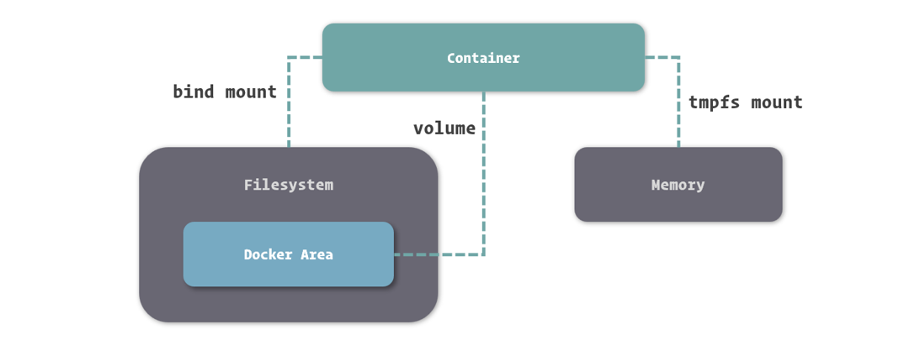

## Get started

#### 1. Orientation

```bash
## List Docker CLI commands
docker
docker container --help

## Display Docker version and info
docker --version
docker version
docker info

## Execute Docker image
docker run hello-world

## List Docker images
docker image ls

## List Docker containers (running, all, all in quiet mode)
docker container ls
docker container ls --all
docker container ls -aq
```

#### 2. Containers

````bash
docker build -t friendlyhello .  # Create image using this directory's Dockerfile
docker run -p 4000:80 friendlyhello  # Run "friendlyhello" mapping port 4000 to 80
docker run -d -p 4000:80 friendlyhello         # Same thing, but in detached mode
docker container ls                                # List all running containers
docker container ls -a             # List all containers, even those not running
docker container stop <hash>           # Gracefully stop the specified container
docker container kill <hash>         # Force shutdown of the specified container
docker container rm <hash>        # Remove specified container from this machine
docker container rm $(docker container ls -a -q)         # Remove all containers
docker image ls -a                             # List all images on this machine
docker image rm <image id>            # Remove specified image from this machine
docker image rm $(docker image ls -a -q)   # Remove all images from this machine
docker login             # Log in this CLI session using your Docker credentials
docker tag <image> username/repository:tag  # Tag <image> for upload to registry
docker push username/repository:tag            # Upload tagged image to registry
docker run username/repository:tag                   # Run image from a registry
````

#### 3. Services

```bash
docker stack ls                                            # List stacks or apps
docker stack deploy -c <composefile> <appname>  # Run the specified Compose file
docker service ls                 # List running services associated with an app
docker service ps <service>                  # List tasks associated with an app
docker inspect <task or container>                   # Inspect task or container
docker container ls -q                                      # List container IDs
docker stack rm <appname>                             # Tear down an application
docker swarm leave --force      # Take down a single node swarm from the manager
```

#### 4.Swarms

```bash
docker-machine create --driver virtualbox myvm1 # Create a VM (Mac, Win7, Linux)
docker-machine create -d hyperv --hyperv-virtual-switch "myswitch" myvm1 # Win10
docker-machine env myvm1                # View basic information about your node
docker-machine ssh myvm1 "docker node ls"         # List the nodes in your swarm
docker-machine ssh myvm1 "docker node inspect <node ID>"        # Inspect a node
docker-machine ssh myvm1 "docker swarm join-token -q worker"   # View join token
docker-machine ssh myvm1   # Open an SSH session with the VM; type "exit" to end
docker node ls                # View nodes in swarm (while logged on to manager)
docker-machine ssh myvm2 "docker swarm leave"  # Make the worker leave the swarm
docker-machine ssh myvm1 "docker swarm leave -f" # Make master leave, kill swarm
docker-machine ls # list VMs, asterisk shows which VM this shell is talking to
docker-machine start myvm1            # Start a VM that is currently not running
docker-machine env myvm1      # show environment variables and command for myvm1
eval $(docker-machine env myvm1)         # Mac command to connect shell to myvm1
& "C:\Program Files\Docker\Docker\Resources\bin\docker-machine.exe" env myvm1 | Invoke-Expression   # Windows command to connect shell to myvm1
docker stack deploy -c <file> <app>  # Deploy an app; command shell must be set to talk to manager (myvm1), uses local Compose file
docker-machine scp docker-compose.yml myvm1:~ # Copy file to node's home dir (only required if you use ssh to connect to manager and deploy the app)
docker-machine ssh myvm1 "docker stack deploy -c <file> <app>"   # Deploy an app using ssh (you must have first copied the Compose file to myvm1)
eval $(docker-machine env -u)     # Disconnect shell from VMs, use native docker
docker-machine stop $(docker-machine ls -q)               # Stop all running VMs
docker-machine rm $(docker-machine ls -q) # Delete all VMs and their disk images	
```


#### 5.Stacks

#### 6.Deploy your app


## 网络

网络的类型有：bridge、host、overlay、maclan、none

```bash
docker network inspect bridge

docker network ls

docker network create --driver bridge --subnet 172.30.0.0/16 --gateway 172.30.0.1 my_bridge
```


- 处于不同网络中的容器彼此间网络不通，可通过`docker network connect` 通信。

- 默认bridge网络中所有容器间只能用IP相互访问。自定义bridge网络中所有容器除ip访问外，还可以直接用容器名作为hostname相互访问。（内嵌DNS）

- docker run指定容器ip启动时仅适用于自定义网络

- 容器启动时指定使用已经存在的容器的网络：--network=container:NAMEor ID

  ```
  docker run -itd --name mysql5 --network=container:mysql1 mysql /bin/bash
  ```

  


## 数据卷与数据卷容器

#### 数据卷

基于底层存储实现，Docker 提供了三种适用于不同场景的文件系统挂载方式：**Bind Mount**、**Volume** 和 **Tmpfs Mount**。



- **Bind Mount** 能够直接将宿主操作系统中的目录和文件挂载到容器内的文件系统中，通过指定容器外的路径和容器内的路径，就可以形成挂载映射关系，在容器内外对文件的读写，都是相互可见的。
- **Volume** 也是从宿主操作系统中挂载目录到容器内，只不过这个挂载的目录由 Docker 进行管理，我们只需要指定容器内的目录，不需要关心具体挂载到了宿主操作系统中的哪里。
- **Tmpfs Mount** 支持挂载系统内存中的一部分到容器的文件系统里，不过由于内存和容器的特征，它的存储并不是持久的，其中的内容会随着容器的停止而消失。


地址：/var/lib/docker/volumes/

- #### （1）docker run -itd -P -v /test:/data --name myhttp httpd

- #### （2）docker run -itd -P -v /data --name myhttp httpd

- #### （3）docker run -itd -P -v my_volume:/data --name myhttp httpd


#### 数据卷容器

所谓数据卷容器，就是一个没有具体指定的应用，甚至不需要运行的容器，我们使用它的目的，是为了定义一个或多个数据卷并持有它们的引用。Docker 的 Network 是容器间的网络桥梁，如果做类比，数据卷容器就可以算是容器间的文件系统桥梁。


创建数据卷容器的方式很简单，由于不需要容器本身运行，因而我们找个简单的系统镜像都可以完成创建。

1：创建数据卷容器

```bash
docker create -it -P -v test_volume:/data --name data_container httpd
```


在使用数据卷容器时，不建议再定义数据卷的名称，因为我们可以通过对数据卷容器的引用来完成数据卷的引用。而不设置数据卷的名称，也避免了在同一 Docker 中数据卷重名的尴尬。可以像加入网络一样引用数据卷容器，只需要在创建新容器时使用专门的 `--volumes-from` 选项即可。

引用数据卷容器时，不需要再定义数据卷挂载到容器中的位置，Docker 会以数据卷容器中的挂载定义将数据卷挂载到引用的容器中。

2：使用上述数据卷容器启动新的容器

```bash
docker run -itd -P --volumes-from data_container --name myhttp1 httpd

docker run -itd -P --volumes-from data_container --name myhttp2 httpd
```


#### 数据备份

1：运行一个mysql数据库容器

```bash
docker run -itd --name mysql -e MYSQL_ROOT_PASSWORD=123456 -p 3306:3306 -v mysql_data:/var/lib/mysql mysql
```

2：备份mysql数据

```bash
docker run -it --rm --volumes-from mysql -v $(pwd):/backup alpine tar zcvf /backup/backup.tar.gz /var/lib/mysql
```
得到：`backup.tar.gz` 文件
>--rm 备份后自动删除容器
>
>--volumes-from 加载上述mysql容器
>
>-v 挂载当前目录到新容器的/backup目录下
>
>tar zcvf /backup/backup.tar.gz /var/lib/mysql 在新容器内执行tar命令将mysql容器的/var/lib/mysql打包成backup.tar.gz放到当前目录下

3：使用备份数据恢复

```bash
docker run -it --rm --volumes-from mysql -v $(pwd):/backup alpine tar zxvf /backup/backup.tar.gz -C /
```


