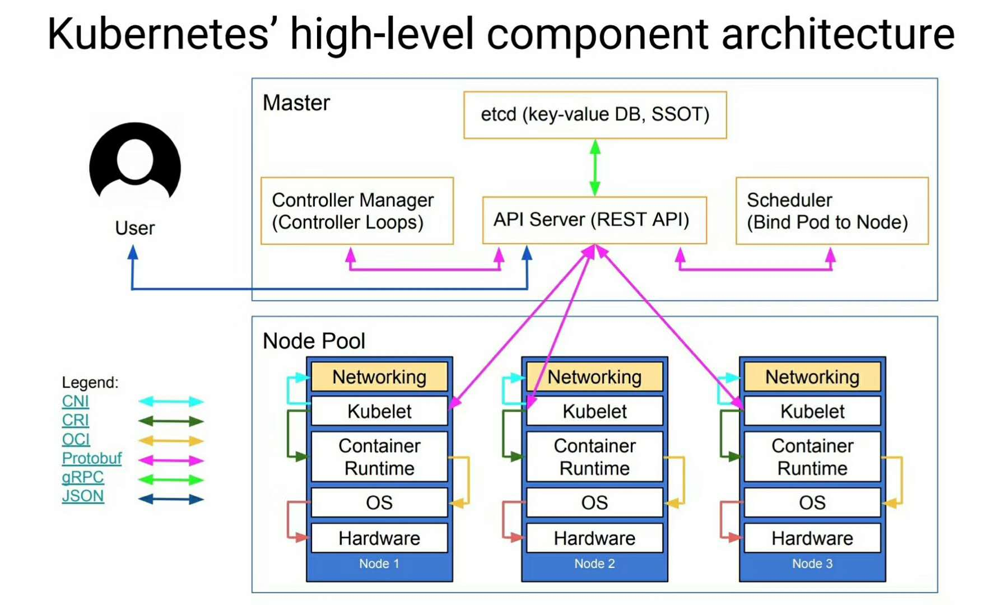

## 镜像加速
#### **1. docker.io镜像加速**

（略）

#### 2. gcr.io镜像加速

拉取谷歌镜像形式：

```bash
docker pull gcr.io/xxx/yyy:zzz
```

使用Azure镜像:

```bash
docker pull gcr.azk8s.cn/xxx/yyy:zzz
```

#### **3. k8s.gcr.io镜像加速**

拉取kubernetes google镜像

```
docker pull k8s.gcr.io/xxx:yyy
```

使用Azure镜像:

```
docker pull gcr.azk8s.cn/google-containers/xxx:yyy
```


## 架构图




## MiniKube 安装（Learning environment）

#### win10环境

**安装kubectl**

1. 下载并配置到PATH环境
    ```bash
    curl -LO https://storage.googleapis.com/kubernetes-release/release/v1.16.0/bin/windows/amd64/kubectl.exe
    ```

2. 测试安装版本
   ```bash
   kubectl version
   ```

**安装使用Minikube**

1. 启动Minikube并创建一个集群集群

    ```dock
    minikube start --image-repository=registry.cn-hangzhou.aliyuncs.com/google_containers --vm-driver hyperv
    ```

2. 使用已有的镜像，创建一个deployment

    ```
    kubectl create deployment hello-minikube --image=gcr.azk8s.cn/google-containers/echoserver:1.10
    ```

3. 访问 `hello-minikube`, 暴露为一个Service

    ```
    kubectl expose deployment hello-minikube --type=NodePort --port=8080
    ```

4. `hello-minikube` Pod 已经起来了

   ```
   kubectl get pod
   ```


5. 获取Service的Url

   ```
   minikube service hello-minikube --url
   ```

6. 访问上述的url

   ```
   curl <url>
   ```

7. 删除 `hello-minikube` Service

   ```
   kubectl delete services hello-minikube
   ```

8. 删除 `hello-minikube` Deployment

   ```
   kubectl delete deployment hello-minikube
   ```

9. 停止Minikube cluster

    ```
    minikube stop
    ```
    
10. 删除Minikube cluster

    ```
    minikube delete
    ```


## Namespace

- Namespace是对一组资源和对象的抽象集合，比如可以用来将系统内部的对象划分为不同的项目组或用户组。
- 常见的pods, services, replication controllers和deployments等都是属于某一个namespace的（默认是default)。
- node, persistentVolumes等则不属于任何namespace。
- Namespace常用来隔离不同的用户，比如Kubernetes自带的服务一般运行在kube-system namespace中。

**创建**

```bash
(1) 命令行直接创建
$ kubectl create namespace new-namespace

(2) 通过文件创建
$ cat my-namespace.yaml
apiVersion: v1
kind: Namespace
metadata:
  name: new-namespace

$ kubectl create -f ./my-namespace.yaml
```

**删除**

```bash
$ kubectl delete namespaces new-namespace
```


## ReplicaSets

```yaml
apiVersion: extensions/v1beta1
kind: ReplicaSet
metadata:
  name: frontend
  # these labels can be applied automatically
  # from the labels in the pod template if not set
  # labels:
    # app: guestbook
    # tier: frontend
spec:
  # this replicas value is default
  # modify it according to your case
  replicas: 3
  # selector can be applied automatically
  # from the labels in the pod template if not set,
  # but we are specifying the selector here to
  # demonstrate its usage.
  selector:
    matchLabels:
      tier: frontend
    matchExpressions:
      - {key: tier, operator: In, values: [frontend]}
  template:
    metadata:
      labels:
        app: guestbook
        tier: frontend
    spec:
      containers:
      - name: php-redis
        image: gcr.io/google_samples/gb-frontend:v3
        resources:
          requests:
            cpu: 100m
            memory: 100Mi
        env:
        - name: GET_HOSTS_FROM
          value: dns
          # If your cluster config does not include a dns service, then to
          # instead access environment variables to find service host
          # info, comment out the 'value: dns' line above, and uncomment the
          # line below.
          # value: env
        ports:
        - containerPort: 80
```


## 样例

`load-balancer-example.yaml`

```
apiVersion: apps/v1
kind: Deployment
metadata:
  labels:
    app.kubernetes.io/name: load-balancer-example
  name: hello-world
spec:
  replicas: 5
  selector:
    matchLabels:
      app.kubernetes.io/name: load-balancer-example
  template:
    metadata:
      labels:
        app.kubernetes.io/name: load-balancer-example
    spec:
      containers:
      - image: gcr.io/google-samples/node-hello:1.0
        name: hello-world
        ports:
        - containerPort: 8080
```

```bash
# creates a Deployment 
kubectl apply -f load-balancer-example.yaml

# Display information about the Deployment
kubectl get deployments hello-world
kubectl describe deployments hello-world

# Display information about your ReplicaSet objects
kubectl get replicasets
kubectl describe replicaset

# Create a Service object that exposes the deployment
kubectl expose deployment hello-world --type=LoadBalancer --name=my-service

# Display information about the Service
kubectl get services my-service

# Display detailed information about the Service
kubectl describe services my-service

# verify these are pod addresses
kubectl get pods --output=wide

# access the Hello World application
curl http://<external-ip>:<port>

# delete the Service
kubectl delete services my-service

# delete the Deployment
kubectl delete deployment hello-world
```


## 常用命令


```
# look for existing Pods
kubectl get pods

# let’s list the current Services from our cluster
kubectl get services

# To create a new service and expose it to external traffic 
kubectl expose deployment/kubernetes-bootcamp --type="NodePort" --port 8080

# To find out what port was opened externally 
kubectl describe services/kubernetes-bootcamp

kubectl describe deployments

# Let’s use this label to query our list of Pods
kubectl get pods -l run=kubernetes-bootcamp

# Let’s use this label to list the existing services
kubectl get services -l run=kubernetes-bootcamp

# To apply a new label we use the label command followed by the object type
kubectl label pod $POD_NAME app=v1

# To delete Services 
kubectl delete service -l run=kubernetes-bootcamp

# scale the Deployment to 4 replicas.
kubectl scale deployments/kubernetes-bootcamp --replicas=4

kubectl describe deployments/kubernetes-bootcamp

# To update the image of the application to version 2
kubectl set image deployments/kubernetes-bootcamp kubernetes-bootcamp=jocatalin/kubernetes-bootcamp:v2

# The update can be confirmed by running a rollout status command
kubectl rollout status deployments/kubernetes-bootcamp

# roll back to our previously working version
kubectl rollout undo deployments/kubernetes-bootcamp

```

