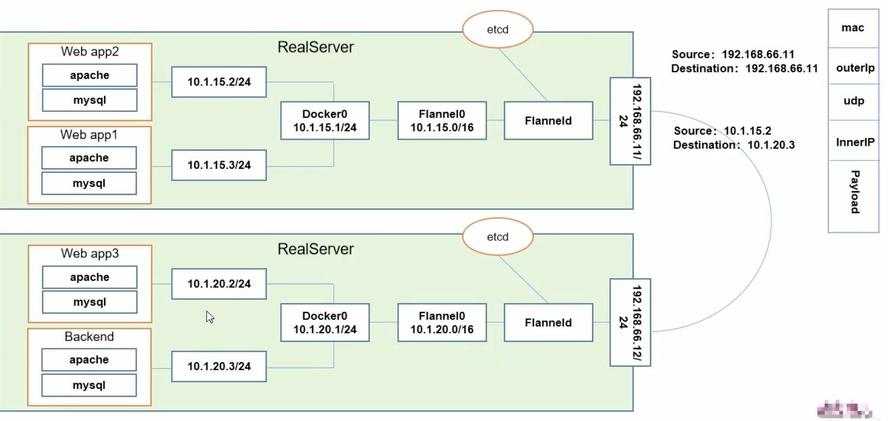
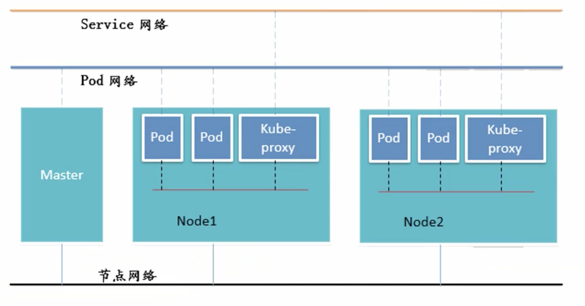
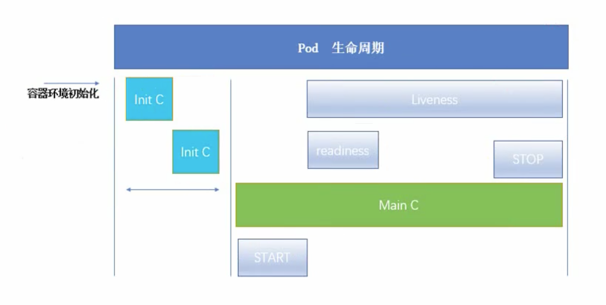

## 镜像加速
#### **1. docker.io镜像加速**

（略）

#### 2. gcr.io镜像加速

拉取谷歌镜像形式：

```bash
docker pull gcr.io/xxx/yyy:zzz
```

使用Azure镜像:

```bash
docker pull gcr.azk8s.cn/xxx/yyy:zzz
```

#### **3. k8s.gcr.io镜像加速**

拉取kubernetes google镜像

```
docker pull k8s.gcr.io/xxx:yyy
```

使用Azure镜像:

```
docker pull gcr.azk8s.cn/google-containers/xxx:yyy
```


## 架构图


## 组件

**Api Server**: 

**Controller Manager**:

**Scheduler**:

**ectd**:

**Kubelet**:

**Kube-proxy**:

**CoreDNS**: 为集群中的SVC创建一个域名IP的对应关系解析

**Dashboard**:

**Ingress Controller**: 官方只能实现4层代理，Ingress 可以实现7层

**Federation**: 提供可以跨集群中心多k8s统一管理功能

**Prometheous**: 集群检控

**ELK**: 集群日志统一分析介入平台


## 网络通讯

- **同一个Pod的多个容器之间**：共享同一个网络命名空间，共享同一个协议栈。lo
- **Pod之间**：Overlay Network
  - pod1与pod2在同一台机器：pod1由docker0网桥直接发送至pod2，不经过Flannel
  - pod1与pod2不在同一台机器：见Flannel
- **Pod与Service之间**： 
  - 各节点的Iptables规则
  - lvs

- **Pod到外网**： 查找路由表，转发数据表到宿主机网卡，宿主机网卡完成路由选择后，iptables执行masquerade，把源IP改成宿主网卡的IP，然后向外发送请求。（SNAT）
- **外网访问Pod**: 借助Service的nodeport方式

**Flannel**：

介绍：

​	 CoreOS为k8s设计的网络规划服务。

功能：

 - 让集群中不同节点主机创建的Docker容器具有全集群唯一的虚拟ip地址。

 - 在这些ip地址间建立一个覆盖网络（Overlay Network），通过它可以将数据包原封不动的传递到容器内部

与ETCD之间：

- 存储管理Flannel可分配的IP地址段资源
- 检控ETCD中每个Pod的实际地址，并在内存中建立维护Pod节点路由表




**三层网络**：



#### Pod



###### Pod phase

- Pending: Pod 已被k8s接收，但有一个或多个容器尚未创建。

- Running: 该Pod已经绑定到一个node上，node中的所有容器都已创建，至少有一个容器正在运行，或者处于启动或重启状态

- Succeeded: Pod中的所有容器都被成功终止，并不会再重启

- Failed:Pod中的所有容器都已终止，并且至少一个容器失败终止，即容器非0状态退出或被系统终止。

- Unknown:

  

###### Init C

- 在Pod启动的过程中，Init容器会按照顺序在**网络和数据卷（由Pause控制）**初始化后启动。每个init C容器必须在上个init C 容器成功退出后才能启动；
- 如果Pod重启，所有init C必须重新执行；（init C 幂等）

**init模板**：

```yaml
apiVersion: v1
kind: Pod
metadata:
 name: myapp-pod
 labels: 
  app: myapp
spec:
 containers:
 - name: myapp-container
   image: busybox
   command: ['sh','-c','echo The app is running! && sleep 3600']
 initContainers:
 - name: init-myservice
   image: busybox
   command: ['sh','-c','until nsloopup myservice; do echo waiting for myservice; sleep2; done;']
 - name: init-mydb
   image: busybox
   command: ['sh','-c','until nsloopup mydb; do echo waiting for mydb; sleep2; done;']
   
  
```

```yaml
apiVersion: v1
kind: Service
metadata:
 name: myservice
spec: 
 ports:
 - protocol: TCP
   port: 80
   targetPort: 9376  
---
apiVersion: v1
kind: Service
metadata:
 name: mydb
spec:
 ports:
 - protocol: TCP
   port: 80
   targetPort: 9377

```

###### 探针

- readliness 不通过，则状态不ready
- Liveness 不通过，则干掉

**检测探针-就绪检测**(readiness)

```yaml
apiVersion: v1
kind: Pod
metadata:
 name: readiness-httpget-pod
spec: 
 containers:
 - name: readiness-httpget-container
   image: xxx/myapp:v1
   imagePullPolicy: IfNotPresent
   readinessProbe:
    httpGet:
     port: 80
     path: /index.html
    initialDelaySeconds: 1
    periodSeconds: 3
```

**检测探针-存活检测**(liveness)

```yaml
apiVersion: v1
kind: Pod
metadata:
 name: liveness-exec-pod
spec:
 containers:
 - name: liveness-exec-container
   image: busybox
   imagePullPolicy: IfNotPresent
   command: ['/bin/bash','-c','touch /tmp/file; sleep 60; rm -rf /tmp/file; sleep 3600']
   livenessProbe:
    exec:
     command: ['test','-e','/tmp/file']
    initialDelaySeconds: 1
    periodSeconds: 3
```

###### 启动和退出

```yaml
apiVersion: v1
kind: Pod
metadata:
 name: lifecycle-demo
spec:
 containers:
 - name: lifecycle-demo-container
   image: nginx
   lifecycle:
    postStart:
     exec:
      command: ['/bin/sh','-c','echo Hello from the postStart handler > /usr/share/msg']
    preStop:
     exec:
      command: ['/bin/sh','-c','echo Hello from the preStop handler > /usr/share/msg']
```

#### Deployment

Deployment为Pod和ReplicaSet提供一个声明式（declarative）方法，典型应用场景：

- 定义Deployment来创建Pod和RS
- 回滚升级和应用
- 扩容和缩容
- 暂停和继续deployment


## MiniKube 安装（Learning environment）

#### win10环境

**安装kubectl**

1. 下载并配置到PATH环境
    ```bash
    curl -LO https://storage.googleapis.com/kubernetes-release/release/v1.16.0/bin/windows/amd64/kubectl.exe
    ```

2. 测试安装版本
   ```bash
   kubectl version
   ```

**安装使用Minikube**

1. 启动Minikube并创建一个集群集群

    ```dock
    minikube start --image-repository=registry.cn-hangzhou.aliyuncs.com/google_containers --vm-driver hyperv
    ```

2. 使用已有的镜像，创建一个deployment

    ```
    kubectl create deployment hello-minikube --image=gcr.azk8s.cn/google-containers/echoserver:1.10
    ```

3. 访问 `hello-minikube`, 暴露为一个Service

    ```
    kubectl expose deployment hello-minikube --type=NodePort --port=8080
    ```

4. `hello-minikube` Pod 已经起来了

   ```
   kubectl get pod
   ```


5. 获取Service的Url

   ```
   minikube service hello-minikube --url
   ```

6. 访问上述的url

   ```
   curl <url>
   ```

7. 删除 `hello-minikube` Service

   ```
   kubectl delete services hello-minikube
   ```

8. 删除 `hello-minikube` Deployment

   ```
   kubectl delete deployment hello-minikube
   ```

9. 停止Minikube cluster

    ```
    minikube stop
    ```
    
10. 删除Minikube cluster

    ```
    minikube delete
    ```


## 集群安装

**操作系统**：Centos7

1. 设置主机名

   ```bash
   hostnamectl set-hostname k8s-master01
   hostnamectl set-hostname k8s-node01
   hostnamectl set-hostname k8s-node02
   ```

2. 设置所有主机的host文件，使主机互通

   ```
   192.168.66.10		k8s-master01
   192.168.66.20		k8s-node01
   192.168.66.21		k8s-node02
   ```

3. 安装依赖包

   ```bash
   yum install -y conntrack	ntpdate	ntp	ipvadm ipset jq iptables curl sysstat libseccomp wget vim net-tools git
   ```

4. 防火墙

5. ```bash
   systemctl stop firewalld 
   systemctl disable firewalld
   yum -y install iptables-services
   systemctl start iptables
   systemctl enable iptables
   iptables -F
   service iptables save
   ```

6. 关闭selinux

   ```bash
   # 关闭虚拟内存
   swapoff -a && set -i '/ swap / s/^\(.*\)$/#\1/g' /etc/fstab
   # 关闭selinux
   setenforce 0 && sed -i 's/^SELINUX=.*/SELINUX=disabled/' /etc/selinux/config
   ```

7. 调整内核参数

   ```
   # 开机自动使用
   cat /etc/sysctl.d/kubernetes.conf
   
   net.bridge.bridge-nf-call-intables=1
   net.bridge.bridge-nf-call-ip6tables=1
   net.ipv6.conf.all.disable_ipv6=1
   
   # 立马生效
   sysctl -p /etc/sysctl.d/kubernetes.conf
   ```

   

8. 调整系统时区

   ```
   # 设置系统时区
   timedatectl set-timezone Asia/Shanghai
   
   # 将当前UTC时间写入硬件时钟
   timedatectl set-local-rtc 0
   
   # 重启依赖系统时间的服务
   systemctl restart rsyslog
   systemctl restart crond
   ```

9. 关闭不需要的服务

   ```bash
   systemctl stop postfix && systemctl disable postfix
   ```

10. 设置rsyslogd 和systemd journald
11. 升级系统内核为4.44


## Namespace

- Namespace是对一组资源和对象的抽象集合，比如可以用来将系统内部的对象划分为不同的项目组或用户组。
- 常见的pods, services, replication controllers和deployments等都是属于某一个namespace的（默认是default)。
- node, persistentVolumes等则不属于任何namespace。
- Namespace常用来隔离不同的用户，比如Kubernetes自带的服务一般运行在kube-system namespace中。

**创建**

```bash
(1) 命令行直接创建
$ kubectl create namespace new-namespace

(2) 通过文件创建
$ cat my-namespace.yaml
apiVersion: v1
kind: Namespace
metadata:
  name: new-namespace

$ kubectl create -f ./my-namespace.yaml
```

**删除**

```bash
$ kubectl delete namespaces new-namespace
```


## ReplicaSets

```yaml
apiVersion: extensions/v1beta1
kind: ReplicaSet
metadata:
  name: frontend
  # these labels can be applied automatically
  # from the labels in the pod template if not set
  # labels:
    # app: guestbook
    # tier: frontend
spec:
  # this replicas value is default
  # modify it according to your case
  replicas: 3
  # selector can be applied automatically
  # from the labels in the pod template if not set,
  # but we are specifying the selector here to
  # demonstrate its usage.
  selector:
    matchLabels:
      tier: frontend
    matchExpressions:
      - {key: tier, operator: In, values: [frontend]}
  template:
    metadata:
      labels:
        app: guestbook
        tier: frontend
    spec:
      containers:
      - name: php-redis
        image: gcr.io/google_samples/gb-frontend:v3
        resources:
          requests:
            cpu: 100m
            memory: 100Mi
        env:
        - name: GET_HOSTS_FROM
          value: dns
          # If your cluster config does not include a dns service, then to
          # instead access environment variables to find service host
          # info, comment out the 'value: dns' line above, and uncomment the
          # line below.
          # value: env
        ports:
        - containerPort: 80
```


## 样例

`load-balancer-example.yaml`

```
apiVersion: apps/v1
kind: Deployment
metadata:
  labels:
    app.kubernetes.io/name: load-balancer-example
  name: hello-world
spec:
  replicas: 5
  selector:
    matchLabels:
      app.kubernetes.io/name: load-balancer-example
  template:
    metadata:
      labels:
        app.kubernetes.io/name: load-balancer-example
    spec:
      containers:
      - image: gcr.io/google-samples/node-hello:1.0
        name: hello-world
        ports:
        - containerPort: 8080
```

```bash
# creates a Deployment 
kubectl apply -f load-balancer-example.yaml

# Display information about the Deployment
kubectl get deployments hello-world
kubectl describe deployments hello-world

# Display information about your ReplicaSet objects
kubectl get replicasets
kubectl describe replicaset

# Create a Service object that exposes the deployment
kubectl expose deployment hello-world --type=LoadBalancer --name=my-service

# Display information about the Service
kubectl get services my-service

# Display detailed information about the Service
kubectl describe services my-service

# verify these are pod addresses
kubectl get pods --output=wide

# access the Hello World application
curl http://<external-ip>:<port>

# delete the Service
kubectl delete services my-service

# delete the Deployment
kubectl delete deployment hello-world
```


## 问题排查

```
kubectl describe pod <pod-name>

kubectl log <pod-name> -c <container-name> 
```


## 常用命令


```
# look for existing Pods
kubectl get pods

# let’s list the current Services from our cluster
kubectl get services

# To create a new service and expose it to external traffic 
kubectl expose deployment/kubernetes-bootcamp --type="NodePort" --port 8080

# To find out what port was opened externally 
kubectl describe services/kubernetes-bootcamp

kubectl describe deployments

# Let’s use this label to query our list of Pods
kubectl get pods -l run=kubernetes-bootcamp

# Let’s use this label to list the existing services
kubectl get services -l run=kubernetes-bootcamp

# To apply a new label we use the label command followed by the object type
kubectl label pod $POD_NAME app=v1

# To delete Services 
kubectl delete service -l run=kubernetes-bootcamp

# scale the Deployment to 4 replicas.
kubectl scale deployments/kubernetes-bootcamp --replicas=4

kubectl describe deployments/kubernetes-bootcamp

# To update the image of the application to version 2
kubectl set image deployments/kubernetes-bootcamp kubernetes-bootcamp=jocatalin/kubernetes-bootcamp:v2

# The update can be confirmed by running a rollout status command
kubectl rollout status deployments/kubernetes-bootcamp

# roll back to our previously working version
kubectl rollout undo deployments/kubernetes-bootcamp

```

