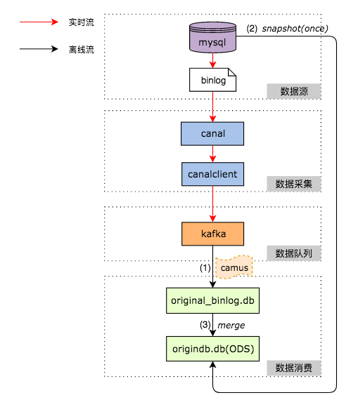

#### 1.初识Kafka

###### 1.1 介绍

Kafka 起初是 由 LinkedIn 公司采用 Scala 语言开发的一个多分区、多副本且基于 ZooKeeper 协调的分布式消息系统。它以高吞吐、可持久化、可水平扩展、支持流数据处理等多种特性而被广泛使用。

Kafka 受到越来越多的青睐，与它所“扮演”的三大角色是分不开的：

- **消息系统**：Kafka 和传统的消息系统（也称作消息中间件）都具备系统解耦、冗余存储、流量削峰、缓冲、异步通信、扩展性、可恢复性等功能。与此同时，它还提供消息顺序性保障及回溯消费的功能。
- **存储系统**：Kafka 把消息持久化到磁盘，相比于其他基于内存存储的系统而言，有效地降低了数据丢失的风险。也正是得益于 Kafka 的消息持久化功能和多副本机制，我们可以把 Kafka 作为长期的数据存储系统来使用，只需要把对应的数据保留策略设置为“永久”或启用主题的日志压缩功能即可。
- **流式处理平台**：Kafka 不仅为每个流行的流式处理框架提供了可靠的数据来源，还提供了一个完整的流式处理类库，比如窗口、连接、变换和聚合等各类操作。

###### 1.2 架构组成

一个典型的 Kafka 体系架构包括若干 Producer、若干 Broker、若干 Consumer，以及一个 ZooKeeper 集群。


**ZooKeeper**: 是 Kafka 用来负责集群元数据的管理、控制器的选举等操作的。

**Producer**:  生产者，也就是发送消息的一方。生产者负责创建消息，然后将其投递到 Kafka 中。

**Broker**: 负责将收到的消息存储到磁盘中。 对于 Kafka 而言，Broker 可以简单地看作一个独立的 Kafka 服务节点或 Kafka 服务实例。大多数情况下也可以将 Broker 看作一台 Kafka 服务器，前提是这台服务器上只部署了一个 Kafka 实例。一个或多个 Broker 组成了一个 Kafka 集群。

**Consumer**: 消费者，也就是接收消息的一方。消费者连接到 Kafka 上并接收消息，进而进行相应的业务逻辑处理。

**Topic** 和 **Partition**: 消息以主题(Topic)为单位进行归类，生产者负责将消息发送到特定的主题(发送到 Kafka 集群中的每一条消息都要指定一个主题），而消费者负责订阅主题并进行消费。

主题是一个逻辑上的概念，它还可以细分为多个分区，一个分区只属于单个主题，很多时候也会把分区称为主题分区（Topic-Partition）。同一主题下的不同分区包含的消息是不同的，分区在存储层面可以看作一个可追加的日志（Log）文件，消息在被追加到分区日志文件的时候都会分配一个特定的偏移量（offset）。


如上图所示，主题中有4个分区，消息被顺序追加到每个分区日志文件的尾部。Kafka 中的分区可以分布在不同的服务器（broker）上，也就是说，一个主题可以横跨多个 broker，以此来提供比单个 broker 更强大的性能。（详见[主题与分区](#主题与分区)章节）


#### 2.安装

###### 2.1利用 docker-compose安装kafka

kafka依赖zookeeper，启动kafka之前，需要先启动zookeeper。docker-compose.yml清单（样例）：

```yml
version: '3.1'
networks:
  kafka-net:
    driver: bridge
    
services:
  zookeeper:
    image: wurstmeister/zookeeper
    ports:
      - 2181:2181
    networks:
      - kafka-net
  kafka:
    image: wurstmeister/kafka
    depends_on:
      - zookeeper
    ports:
      - 9092:9092
    environment:
      KAFKA_ADVERTISED_HOST_NAME: 172.171.15.98						# 宿主机IP
      KAFKA_ZOOKEEPER_CONNECT: zookeeper:2181
    volumes:
      - /etc/localtime:/etc/localtime						         #kafka镜像和宿主机器之间时间保持一致
    networks:
      - kafka-net
  kafka-manager:
    image: sheepkiller/kafka-manager
    environment:
      ZK_HOSTS: zookeeper
    ports:
      - 9000:9000
    networks:
      - kafka-net
```

在docker-compose.yml 所属的同目录下执行操作控制服务启停：

```bash
# 启动服务
docker-compose up -d

# 停止服务
docker-compose stop

# 停止并删除服务
docker-compose down
```


###### 2.2 直接在CentOS上的安装kafka

搭建 Kafka 运行环境需要涉及 ZooKeeper，Kafka 和 ZooKeeper 都是运行在 JVM 之上的服务，所以需要先安装 JDK。

- **第1步，安装JDK**。进入Oracle官网下载jdk-8u181-linux-x64.tar.gz，然后将其复制到/opt目录下，进行以下操作：

```bash
[root@node1 opt]# ll jdk-8u181-linux-x64.tar.gz 
-rw-r--r-- 1 root root 185646832 Aug 31 14:48 jdk-8u181-linux-x64.tar.gz

# 解压, 然后当前/opt目录下生成一个名为jdk1.8.0_181的文件夹
[root@node1 opt]# tar zxvf jdk-8u181-linux-x64.tar.gz 

# 进入安装目录
[root@node1 opt]# cd jdk1.8.0_181/

# 查看安装路径
[root@node1 jdk1.8.0_181]# pwd
/opt/jdk1.8.0_181
```

配置 JDK 的环境变量，修改文件/etc/profile，向其中添加如下配置：

```bash
export JAVA_HOME=/opt/jdk1.8.0_181
export JRE_HOME=$JAVA_HOME/jre
export PATH=$PATH:$JAVA_HOME/bin
export CLASSPATH=./://$JAVA_HOME/lib:$JRE_HOME/lib
```

执行 `source /etc/profile `，使得上述配置生效。验证方式：

```bash
[root@node1 ~]# java -version
java version "1.8.0_181"
Java(TM) SE Runtime Environment (build 1.8.0_181-b13)
Java HotSpot(TM) 64-Bit Server VM (build 25.181-b13, mixed mode)
```

- **第2步，安装Zookeeper**

ZooKeeper 是安装 Kafka 集群的必要组件，Kafka 通过 ZooKeeper 来实施对元数据信息的管理，包括集群、broker、主题、分区等内容。下载安装包zookeeper-3.4.12.tar.gz，将其复制到/opt目录下，进行以下操作：

```bash
[root@node1 opt]# ll zookeeper-3.4.12.tar.gz 
-rw-r--r-- 1 root root 36667596 Aug 31 15:55 zookeeper-3.4.12.tar.gz

# 解压，然后当前/opt目录下生成一个名为zookeeper-3.4.12的文件夹
[root@node1 opt]# tar zxvf zookeeper-3.4.12.tar.gz 

# 进入目录
[root@node1 opt]# cd zookeeper-3.4.12

# 查看安装路径
[root@node1 zookeeper-3.4.12]# pwd
/opt/zookeeper-3.4.12
```

向/etc/profile 配置文件中添加如下内容，并执行 `source /etc/profile` 命令使配置生效:

```bash
export ZOOKEEPER_HOME=/opt/zookeeper-3.4.12
export PATH=$PATH:$ZOOKEEPER_HOME/bin
```

修改 ZooKeeper 的配置文件。首先进入$ZOOKEEPER_HOME/conf目录，并将zoo_sample.cfg 文件修改为 zoo.cfg：

```bash
[root@node1 zookeeper-3.4.12]# cd conf
[root@node1 conf]# cp zoo_sample.cfg zoo.cfg
```

修改 zoo.cfg 配置文件，zoo.cfg 文件的内容参考如下:

```bash
# ZooKeeper服务器心跳时间，单位为ms
tickTime=2000

# 投票选举新leader的初始化时间
initLimit=10

# leader与follower心跳检测最大容忍时间，响应超过syncLimit*tickTime，leader认为
# follower“死掉”，从服务器列表中删除follower
syncLimit=5

# 数据目录
dataDir=/tmp/zookeeper/data

# 日志目录
dataLogDir=/tmp/zookeeper/log

# ZooKeeper对外服务端口
clientPort=2181
```

默认情况下，Linux 系统中没有/tmp/zookeeper/data 和/tmp/zookeeper/log 这两个目录，所以接下来还要创建这两个目录：

```bash
[root@node1 conf]# mkdir -p /tmp/zookeeper/data
[root@node1 conf]# mkdir -p /tmp/zookeeper/log
```

在${dataDir}目录（也就是/tmp/zookeeper/data）下创建一个 myid 文件，并写入一个数值，比如0。myid 文件里存放的是服务器的编号。

启动 Zookeeper 服务：

```bash
[root@node1 conf]# zkServer.sh start
JMX enabled by default
Using config: /opt/zookeeper-3.4.6/bin/../conf/zoo.cfg
Starting zookeeper ... STARTED
```

可以通过 zkServer.sh status 命令查看 Zookeeper 服务状态:

```bash
[root@node1 ]# zkServer.sh status
JMX enabled by default
Using config: /opt/zookeeper-3.4.12/bin/../conf/zoo.cfg
Mode: Standalone
```

- **第3步，安装Kafka**

下载安装包 kafka_2.11-2.0.0.tgz，将其复制到/opt目录下，进行以下操作：

```bash
[root@node1 opt]# ll kafka_2.11-2.0.0.tgz 
-rw-r--r-- 1 root root 55751827 Jul 31 10:45 kafka_2.11-2.0.0.tgz

[root@node1 opt]# tar zxvf kafka_2.11-2.0.0.tgz

# 解压之后当前/opt目录下生成一个名为kafka_2.11-2.0.0的文件夹
[root@node1 opt]# cd kafka_2.11-2.0.0

```

Kafka的根目录$KAFKA_HOME即为/opt/kafka_2.11-2.0.0，可以将Kafka_HOME添加到/etc/profile文件中，具体做法可以参考前面JDK和ZooKeeper的安装示例。

修改 broker 的配置文件 $KAFKA_HOME/conf/server.properties。主要关注以下几个配置参数即可：

```bash
# broker的编号，如果集群中有多个broker，则每个broker的编号需要设置的不同
broker.id=0

# broker对外提供的服务入口地址
listeners=PLAINTEXT://localhost:9092

# 存放消息日志文件的地址
log.dirs=/tmp/kafka-logs

# Kafka所需的ZooKeeper集群地址，为了方便演示，我们假设Kafka和ZooKeeper都安装在本机
zookeeper.connect=localhost:2181/kafka
```

在$KAFKA_HOME 目录下执行下面的命令启动 Kafka 服务：

```bash
bin/kafka-server-start.sh config/server.properties
```

也可以在后台运行 Kafka 服务，那么可以在启动命令中加入 -daemon 参数或&字符

```bash
bin/kafka-server-start.sh –daemon config/server.properties
# 或者
bin/kafka-server-start.sh config/server.properties &
```

验证是否正常启动：

```bash
[root@node1 kafka_2.11-2.0.0]# jps -l
23152 sun.tools.jps.Jps
16052 org.apache.zookeeper.server.quorum.QuorumPeerMain
22807 kafka.Kafka  # 这个就是Kafka服务端的进程	
```


#### 3.生产者


###### 3.1 生产者客户端样例

一个正常的生产逻辑需要具备以下几个步骤：

>1. 配置生产者客户端参数及创建相应的生产者实例。
>2. 构建待发送的消息。
>3. 发送消息。
>4. 关闭生产者实例。

```java
public static void main(String[] args) throws Exception {
    // 1.配置生产者客户端参数及创建相应的生产者实例
    Properties properties = new Properties();
    properties.put("key.serializer", "org.apache.kafka.common.serialization.StringSerializer");
    properties.put("value.serializer", "org.apache.kafka.common.serialization.StringSerializer");
    properties.put("bootstrap.servers", "localhost:9092");
    properties.put("client.id", "producer.client.id.demo");
    KafkaProducer<String, String> producer = new KafkaProducer<>(properties);
    // 2. 构建待发送的消息
    ProducerRecord<String, String> record = new ProducerRecord<>("topic-demo", "hello, Kafka!");
    // 3.发送消息
    producer.send(record);
    // 4.关闭生产者实例
    producer.close();
}
```

必要参数配置：

- **bootstrap.servers**: 该参数用来指定生产者客户端连接 Kafka 集群所需的 broker 地址清单，具体的内容格式为 host1:port1,host2:port2。

  注意这里并非需要所有的 broker 地址，因为生产者会从给定的 broker 里查找到其他 broker 的信息。建议至少要设置两个以上的 broker 地址信息。

- **key.serializer** 和 **value.serializer**:  broker 端接收的消息必须以字节数组（byte[]）的形式存在。producer在发往 broker 之前需要将消息中对应的 key 和 value 做相应的序列化操作来转换成字节数组。注意这里必须填写序列化器的全限定名，单单指定 StringSerializer 是错误的。

最佳实践：

- 在实际使用过程中，诸如`key.serializer`、`max.request.size`、`interceptor.classes`之类的字符串经常由于人为因素而书写错误。为此，我们可以直接使用客户端中的 `org.apache.kafka.clients.producer.ProducerConfig` 类来做一定程度上的预防措施，每个参数在 `ProducerConfig` 类中都有对应的名称。例：

  ```java
properties.put(ProducerConfig.KEY_SERIALIZER_CLASS_CONFIG,StringSerializer.class.getName());
  ```

- `KafkaProducer` 是线程安全的，可以在多个线程中共享单个` KafkaProducer` 实例，也可以将 `KafkaProducer` 实例进行池化来供其他线程调用。

- 参数 `client.id`，这个参数用来设定 KafkaProducer 对应的客户端id，默认值为“”。

- 集成到springboot以后，可以直接在application.yml文件里配置 。例如：

  ```yml
  spring:
    kafka:
      bootstrap-servers: 172.171.15.98:9092
      producer:
        # 生产者重试的次数
        retries: 0
        # BufferPool实现ByteBuffer 的复用。每次批量发送消息的大小(16KB)
        batch-size: 16384
        # RecordAccumulator 缓存大小 （32MB）
        buffer-memory: 33554432
        # 指定消息key和消息体的编解码方式
        key-serializer: org.apache.kafka.common.serialization.StringSerializer
        value-serializer: org.apache.kafka.common.serialization.StringSerializer
        # 确认副本数。用来指定分区中必须要有多少个副本收到这条消息，之后生产者才会认为这条消息是成功写入的。
        acks: 1
      consumer:
        # 指定默认消费者group id
        group-id: test-consumer-group
        auto-commit-interval: 100
        # 当消费者查找不到所记录的消费位移时,从分区末尾开始消费消息
        auto-offset-reset: latest
        # 由kafka自动提交
        enable-auto-commit: true
        # 指定消息key和消息体的编解码方式
        key-deserializer: org.apache.kafka.common.serialization.StringDeserializer
        value-deserializer: org.apache.kafka.common.serialization.StringDeserializer
  ```

  然后注入模板对象直接使用：

    ```java
    @Autowired
    KafkaTemplate kafkaTemplate;
    ```


###### 3.2 发送的消息对象 

消息对象 `ProducerRecord`，包含了很多属性，其中 topic 属性和 value 属性是必填项：

```java
package org.apache.kafka.clients.producer;
public class ProducerRecord<K, V> {
    private final String topic; //主题  		   （必填）
    private final Integer partition; //分区号
    private final Headers headers; //消息头部
    private final K key; //键
    private final V value; //值   				（必填）
    private final Long timestamp; //消息的时间戳
    //省略其他成员方法和构造方法
}
```

>**headers**: 消息的头部, 它大多用来设定一些与应用相关的信息，如无需要也可以不用设置。
>
>**key**: 指定消息的键，它不仅是消息的附加信息，还可以用来计算分区号进而可以让消息发往特定的分区。前面提及消息以主题为单位进行归类，而这个 key 可以让消息再进行二次归类。有 key 的消息还可以支持日志压缩的功能。
>
>**value**:  消息体，一般不为空。如果为空，则表示为墓碑消息（tombstone）。


###### 3.3 消息发送

创建生产者实例和构建消息之后，就可以开始发送消息了。发送消息主要有三种模式：发后即忘（fire-and-forget）、同步（sync）及异步（async）。

- **发后即忘**： 上述代码`producer.send(record)`就是发后即忘。只管往broker发送，而不关心是否正确到达。这种方式稳定性最高，可靠性也最差。

- **同步**： ` producer.send(record).get()`。实际上 send() 方法本身就是异步的，返回的 Future 对象可以使调用方稍后获得发送的结果。执行 send() 方法之后直接链式调用了 get() 方法来阻塞等待 Kafka 的响应，直到消息发送成功，或者发生异常。类似`Future<?>  ExecutorService.submit(Runnable task)`。返回对象`RecordMetadata`包含了当前消息的主题、分区号、分区中的偏移量（offset）、时间戳等元数据信息。

  ```java
  public Future<RecordMetadata> send(ProducerRecord<K, V> record)
  ```

- **异步**： 设置回调接口，例:

  ```java
  producer.send(record, new Callback() {
      /**
      * metadata 与 exception 是互斥的。两个参数有且仅有一个为null。
      */
      @Override
      public void onCompletion(RecordMetadata metadata, Exception exception) {
          if (exception != null) {
              // 异常处理。比如可以将异常记录以便日后分析，也可以做一定的处理来进行消息重发。
              exception.printStackTrace();
          } else {
              // 发送成功。
              System.out.println(metadata.topic() + "-" +
                      metadata.partition() + ":" + metadata.offset());
          }
      }
  });
  ```


对于同一个分区而言，如果消息 record1 于 record2 之前先发送，那么 KafkaProducer 就可以保证对应的 callback1 在 callback2 之前调用。


###### 3.4 异常

主要分为**可重试的异常**和**不可重试的异常**

- **可重试异常**：常见的可重试异常有：`NetworkException`、`LeaderNotAvailableException`等。可以配置重试参数`props.put(ProducerConfig.RETRIES_CONFIG, 5)`。如果重试之后仍抛出异常，发送的外层逻辑就要处理这些异常了。

  - 网络瞬时故障而导致的异常，可以通过重试解决;

  - 分区的 leader 副本不可用,异常通常发生在 leader 副本下线而新的 leader 副本选举完成之前，重试之后可以重新恢复。

- **不可重试异常**：比如：`RecordTooLargeException` 异常。不会进行任何重试，直接抛出异常。


###### 3.5 发送端流程

整个生产者客户端由两个线程协调运行，这两个线程分别为主线程和 Sender 线程。在主线程中由 KafkaProducer 创建消息，然后通过可能的拦截器、序列化器和分区器的作用之后缓存到消息累加器中(双端队列)。Sender 线程负责从 RecordAccumulator 中获取消息并将其发送到 Kafka 中。


拦截器

生产者拦截器既可以用来在消息发送前做一些准备工作，比如按照某个规则过滤不符合要求的消息、修改消息的内容等，也可以用来在发送回调逻辑前做一些定制化的需求，比如统计类工作。实现`org.apache.kafka.clients.producer. ProducerInterceptor `接口。


序列化

生产者需要用序列化器（Serializer）把对象转换成字节数组才能通过网络发送给 Kafka。而在对侧，消费者需要用反序列化器（Deserializer）把从 Kafka 中收到的字节数组转换成相应的对象。

上述例子中，K-V 都使用了`org.apache.kafka.common.serialization.StringSerializer`，我们也可以实现`org.apache.kafka.common.serialization.Serializer`接口，自定义序列化方案。但必须保证producer和consumer一致。


分区器

如果消息 ProducerRecord 中指定了 partition 字段，那么就不需要分区器的作用。如果消息 ProducerRecord 中没有指定 partition 字段，那么就需要依赖分区器，根据 key 这个字段来计算 partition 的值。分区器的作用就是为消息分配分区。

Kafka 中提供的默认分区器是 `org.apache.kafka.clients.producer.internals.DefaultPartitioner`。也可以实现`org.apache.kafka.clients.producer.Partitioner`接口自定义分区器。


消息累加器RecordAccumulator

 主要用来缓存消息以便 Sender 线程可以批量发送，进而减少网络传输的资源消耗以提升性能。RecordAccumulator 缓存的大小可以通过生产者客户端参数 buffer.memory 配置（默认32MB）。

主线程中发送过来的消息都会被追加到 RecordAccumulator 的某个双端队列（Deque）中，在 RecordAccumulator 的内部为每个分区都维护了一个双端队列，队列中的内容就是 ProducerBatch。消息写入缓存时，追加到双端队列的尾部；Sender 读取消息时，从双端队列的头部读取。


InFlightRequests 

主要作用是缓存了已经发出去但还没有收到响应的请求。


#### 4.消费者

###### 4.1 消费者与消费组

Kafka 中的消费是基于拉模式的。应用程序可以通过 KafkaConsumer 来订阅主题，并从订阅的主题中拉取消息。

在 Kafka 的消费理念中有一层消费组（Consumer Group）的概念，每个消费者都有一个对应的消费组。当消息发布到主题后，只会被投递给订阅它的**每个消费组中的一个**消费者。


如上图所示，某个主题中共有4个分区（Partition）：P0、P1、P2、P3。有两个消费组A和B都订阅了这个主题，消费组A中有4个消费者（C0、C1、C2和C3），消费组B中有2个消费者（C4和C5）。

按照 Kafka 默认的规则，最后的分配结果是消费组A中的每一个消费者分配到1个分区，消费组B中的每一个消费者分配到2个分区，两个消费组之间互不影响。每个消费者只能消费所分配到的分区中的消息。换言之，每一个分区只能被一个消费组中的一个消费者所消费。


**分配逻辑**

分配逻辑都是基于默认的分区分配策略进行分析的，可以通过消费者客户端参数 `partition.assignment.strategy` 来设置消费者与订阅主题之间的分区分配策略。


**消息投递**

一般有两种消息投递模式：点对点（P2P，Point-to-Point）模式和发布/订阅（Pub/Sub）模式。在kafka中，同时支持这两种模式：

- 如果所有的消费者都隶属于同一个消费组，那么所有的消息都会被均衡地投递给每一个消费者，即每条消息只会被一个消费者处理，这就相当于P2P模式的应用。
- 如果所有的消费者都隶属于不同的消费组，那么所有的消息都会被广播给所有的消费者，即每条消息会被所有的消费者处理，这就相当于Pub/Sub模式的应用。

消费组是一个逻辑上的概念，每一个消费者只隶属于一个消费组。每一个消费组都会有一个固定的名称，消费者在进行消费前需要指定其所属消费组的名称，这个可以通过消费者客户端参数 group.id 来配置。

消费者并非逻辑上的概念，它是实际的应用实例，它可以是一个线程，也可以是一个进程。同一个消费组内的消费者既可以部署在同一台机器上，也可以部署在不同的机器上。


###### 4.2 消费者客户端样例

一个正常的消费逻辑需要具备以下几个步骤：

>1. 配置消费者客户端参数及创建相应的消费者实例
>2. 订阅主题
>3. 拉取消息并消费
>4. 提交消费位移
>5. 关闭消费者实例

```java
public static void main(String[] args) {
    // 配置消费者客户端参数及创建相应的消费者实例
    Properties props = new Properties();
    props.put("key.deserializer", "org.apache.kafka.common.serialization.StringDeserializer");
    props.put("value.deserializer", "org.apache.kafka.common.serialization.StringDeserializer");
    props.put("bootstrap.servers", "localhost:9092");
    // 消费者隶属的消费组的名称，默认值为“”。如果设置为空，则会报出异常。这个参数需要设置成具有一定的业务意义的名称
    props.put("group.id", "group.demo");
    props.put("client.id", "consumer.client.id.demo");
    KafkaConsumer<String, String> consumer = new KafkaConsumer<>(props);
    // 订阅主题.一个或多个
    consumer.subscribe(Arrays.asList("topic-demo"));
    try {
        while (true) {
            // 拉取消息并消费
            ConsumerRecords<String, String> records = consumer.poll(Duration.ofMillis(1000));
            for (ConsumerRecord<String, String> record : records) {
                System.out.println(record);
                //do something to process record.
            }
        }
    } catch (Exception e) {
        e.printStackTrace();
    } finally {
        // 关闭消费者实例
        consumer.close();
    }
}
```

**主题订阅**

- 消费者可以直接订阅一个或多个主题，也支持正则方式匹配：

```
consumer.subscribe(Pattern.compile("topic-.*"));
```

通过 subscribe() 方法订阅主题具有消费者自动再均衡的功能，在多个消费者的情况下可以根据分区分配策略来自动分配各个消费者与分区的关系。当消费组内的消费者增加或减少时，分区分配关系会自动调整，以实现消费负载均衡及故障自动转移。

- 消费者也直接订阅某些主题的特定分区：

```
// 只订阅 topic-demo 主题中分区编号为0的分区
consumer.assign(Arrays.asList(new TopicPartition("topic-demo", 0)));
```

通过 assign() 方法订阅分区时，是不具备消费者自动均衡的功能的。


###### 4.3 位移与提交

在 Kafka 中默认的消费位移的提交方式是自动提交，这个由消费者参数 enable.auto.commit 配置，默认值为 true。当然这个默认的自动提交不是每消费一条消息就提交一次，而是定期提交，这个定期的周期时间由客户端参数auto.commit.interval.ms 配置，默认值为5秒。

自动位移提交的动作是在 poll() 方法的逻辑里完成的，在每次真正向服务端发起拉取请求之前会检查是否可以进行位移提交，如果可以，那么就会提交上一次轮询的位移。


参考上图中的消费位移，x表示某一次拉取操作中此分区消息的最大偏移量，假设当前消费者已经消费了x位置的消息，那么我们就可以说消费者的消费位移为x，图中也用了 lastConsumedOffset 这个单词来标识它。

当前消费者需要提交的消费位移并不是x，而是x+1，对应于上图中的 position，它表示下一条需要拉取的消息的位置。

`KafkaConsumer` 类提供了 position 和 committed 两个方法来分别获取上面所说的 position 和 committed offset 的值。

```
public long position(TopicPartition partition)
public OffsetAndMetadata committed(TopicPartition partition)
```

对于位移提交的具体时机的把握很有讲究，有可能会发生消息丢失或重复消费的现象。


- **消息丢失**: 当前一次 poll() 操作所拉取的消息集为 [x+2, x+7]，x+2 代表上一次提交的消费位移，说明已经完成了 x+1 之前（包括 x+1 在内）的所有消息的消费，x+5 表示当前正在处理的位置。如果拉取到消息之后就进行了位移提交，即提交了 x+8，那么当前消费 x+5 的时候遇到了异常，在故障恢复之后，我们重新拉取的消息是从 x+8 开始的。也就是说，x+5 至 x+7 之间的消息并未能被消费，如此便发生了消息丢失的现象。
- **重复消费**: 位移提交的动作是在消费完所有拉取到的消息之后才执行的，那么当消费 x+5 的时候遇到了异常，在故障恢复之后，我们重新拉取的消息是从 x+2 开始的。也就是说，x+2 至 x+4 之间的消息又重新消费了一遍，故而又发生了重复消费的现象。

**手动提交 **使得对消费位移的管理控制更加灵活，需要将消费者参数 enable.auto.commit 配置为 false。它分为**同步提交** 和**异步提交**

- **同步提交**：对应`KafkaConsumer.commitSync() `。

  ```java
   ConsumerRecords<String, String> records = consumer.poll(1000);
     for (ConsumerRecord<String, String> record : records) {
         // 业务逻辑
     }
   consumer.commitSync();
  ```

  很多时候，也会按照分区粒度划分提交位移的界限：

  ```java
  try {
      while (isRunning.get()) {
          ConsumerRecords<String, String> records = consumer.poll(1000);
          for (TopicPartition partition : records.partitions()) {
              List<ConsumerRecord<String, String>> partitionRecords =
                      records.records(partition);
              for (ConsumerRecord<String, String> record : partitionRecords) {
                  // 业务逻辑
              }
              long lastConsumedOffset = partitionRecords.get(partitionRecords.size() - 1).offset();
              consumer.commitSync(Collections.singletonMap(partition,
                      new OffsetAndMetadata(lastConsumedOffset + 1)));
          }
      }
  } finally {
      consumer.close();
  }
  ```

  

- **异步提交**：对应`KafkaConsumer.commitAsync()`。

  ```java
  ConsumerRecords<String, String> records = consumer.poll(1000);
  for (ConsumerRecord<String, String> record : records) {
      // 业务逻辑
  }
  consumer.commitAsync(new OffsetCommitCallback() {
      @Override
      public void onComplete(Map<TopicPartition, OffsetAndMetadata> offsets,
                             Exception exception) {
          if (exception == null) {
              System.out.println(offsets);
          }else {
              log.error("fail to commit offsets {}", offsets, exception);
          }
      }
  });
  ```

`poll(timeout)` 的设置取决于应用程序对响应速度的要求，比如需要在多长时间内将控制权移交给执行轮询的应用线程。可以直接将 timeout 设置为0，这样 poll() 方法会立刻返回，而不管是否已经拉取到了消息。

如果位移提交失败的情况经常发生，那么说明系统肯定出现了故障，在一般情况下，位移提交失败的情况很少发生。


###### 4.4控制或关闭消费

在有些应用场景下我们可能需要暂停某些分区的消费而先消费其他分区，当达到一定条件时再恢复这些分区的消。`KafkaConsumer` 中使用 pause() 和 resume() 方法来分别实现暂停某些分区在拉取操作时返回数据给客户端和恢复某些分区向客户端返回数据的操作。

```java
public void pause(Collection<TopicPartition> partitions)
public void resume(Collection<TopicPartition> partitions)
```


###### 4.5接收的消息对象

poll() 方法的返回值类型是`ConsumerRecords`，它用来表示一次拉取操作所获得的消息集，内部包含了若干 ConsumerRecord，它提供了一个 iterator() 方法来循环遍历消息集内部的消息。

消费的消息`ConsumerRecord`，包含了很多属性：

```java
public class ConsumerRecord<K, V> {
    private final String topic;		// 主题
    private final int partition;	// 分区号
    private final long offset;		// 消息在所属分区的偏移量
    private final long timestamp;	
    // 表示时间戳的类型。CreateTime和LogAppendTime，分别代表消息创建的时间戳和消息追加到日志的时间戳。
    private final TimestampType timestampType;
    private final int serializedKeySize;    // key序列化之后的大小
    private final int serializedValueSize;  // value序列化之后的大小
    private final Headers headers;	        //头部内容
    private final K key;
    private final V value;		     // 一般是业务要读取的对象
    private volatile Long checksum;  //  CRC32 的校验值
	    //省略若干方法
}
```


###### 4.6 消费者多线程

`KafkaProducer `是线程安全的，然而`KafkaConsumer` 却是非线程安全的(定义了一个 acquire() 方法，用来检测当前是否只有一个线程在操作，若有其他线程正在操作则会抛出` ConcurrentModifcationException` 异常)。

`KafkaConsumer`非线程安全并不意味着我们在消费消息的时候只能以单线程的方式执行，我们可以通过一下方式来实现多线程消费：**线程封闭** 和 **消息处理多线程**。

线程封闭，即为每个线程实例化一个 KafkaConsumer 对象：


消息处理多线程：减少TCP连接并具有横向扩展能力


#### 5. <a id="主题与分区">主题与分区</a> 

主题和分区是 Kafka 的两个核心概念，主题作为消息的归类，可以再细分为一个或多个分区，分区也可以看作对消息的二次归类。分区的划分不仅为 Kafka 提供了可伸缩性、水平扩展的功能，还通过多副本机制来为 Kafka 提供数据冗余以提高数据可靠性。

同一分区的不同副本中保存的是相同的消息（在同一时刻，副本之间并非完全一样），副本之间是“一主多从”的关系，其中 leader 副本负责处理读写请求，follower 副本只负责与 leader 副本的消息同步。副本处于不同的 broker 中，当 leader 副本出现故障时，从 follower 副本中重新选举新的 leader 副本对外提供服务。Kafka 通过多副本机制实现了故障的自动转移，当 Kafka 集群中某个 broker 失效时仍然能保证服务可用。


生产者和消费者只与 leader 副本进行交互，而 follower 副本只负责消息的同步，很多时候 follower 副本中的消息相对 leader 副本而言会有一定的滞后。

每个副本对应一个日志文件，每个日志文件对应一至多个日志分段，每个日志分段还可以细分为索引文件、日志存储文件和快照文件等。


在一个包含3个broker节点的集群上利用以下命令创建主题

```bash
# 创建了一个分区数为4、副本因子为2的主题 "topic-create"
./kafka-topics.sh --zookeeper localhost:2181/kafka --create --topic topic-create --partitions 4 --replication-factor 2

```

在执行完脚本之后，Kafka 会在 log.dir 或 log.dirs 参数所配置的目录下创建相应的主题分区。

```bash
# node-1
ls -al /tmp/kafka-logs/ | grep topic-create
drwxr-xr-x   2 root root 4096 Sep  8 15:54 topic-create-0
drwxr-xr-x   2 root root 4096 Sep  8 15:54 topic-create-1

# node-2
ls -al /tmp/kafka-logs/ |grep topic-create
drwxr-xr-x   2 root root   4096 Sep  8 15:49 topic-create-1
drwxr-xr-x   2 root root   4096 Sep  8 15:49 topic-create-2
drwxr-xr-x   2 root root   4096 Sep  8 15:49 topic-create-3

# node-3
ls -al /tmp/kafka-logs/ |grep topic-create
drwxr-xr-x   2 root root 4096 Sep  8 07:54 topic-create-0
drwxr-xr-x   2 root root 4096 Sep  8 07:54 topic-create-2
drwxr-xr-x   2 root root 4096 Sep  8 07:54 topic-create-3
```

三个broker节点一共创建了8个文件夹（分区数4 * 副本因子2），每个副本与日志一一对应，对应命名 <topic>-<partition>


#### 6. 幂等性与事务

###### 6.1 幂等性

在很多要求严格的场景下，例如用Kafka处理交易数据，`Exactly Once`语义是必须的。我们可以通过让下游系统具有幂等性来配合Kafka的`At Least Once`语义来间接实现`Exactly Once`。但是：

- 该方案要求下游系统支持幂等操作
- 实现门槛相对较高，需要用户对Kafka的工作机制非常了解


Kafka引入了`Producer ID`（即`PID`）和`Sequence Number`。每个新的Producer在初始化的时候会被分配一个唯一的PID，该Producer发送数据的每个`<Topic, Partition>`都对应一个从0开始单调递增的`Sequence Number`。

Broker端也会为每个`<PID, Topic, Partition>`维护一个序号，并且每次Commit一条消息时将其对应序号递增。对于接收的每条消息，如果其序号比Broker维护的序号（即最后一次Commit的消息的序号）大一，则Broker会接受它，否则将其丢弃。

- 如果消息序号比Broker维护的序号大一以上，说明中间有数据尚未写入，也即乱序，此时Broker拒绝该消息，Producer抛出`InvalidSequenceNumber`
- 如果消息序号小于等于Broker维护的序号，说明该消息已被保存，即为重复消息，Broker直接丢弃该消息，Producer抛出`DuplicateSequenceNumber`

这样就保证了单个Producer对于同一个`<Topic, Partition>`的`Exactly Once`语义。


###### 6.2 事务消息

**事务消息**，kafka 中的事务特性主要用于一下两种场景：

- **生产者发送多条消息可以封装在一个事务中，形成一个原子操作。**多条消息要么都发送成功，要么都发送失败。
- **read-process-write模式：将消息消费和生产封装在一个事务中，形成一个原子操作。** 在一个应用处理中，服务需要从上游接收消息，经过处理后，再将消息发送到下游。

> 当事务中仅仅存在Consumer消费消息的操作时，它和Consumer手动提交Offset并没有区别。因此单纯的消费消息并不是Kafka引入事务机制的原因，单纯的消费消息没有必要存在于一个事务中。

`KafkaProducer`类为我们提供了用于事务操作的接口：

```java
    // 初始化事务
    public void initTransactions();
    // 开启事务
    public void beginTransaction() throws ProducerFencedException ;
    // 在事务内提交已经消费的偏移量
    public void sendOffsetsToTransaction(Map<TopicPartition, OffsetAndMetadata> offsets, 
                                         String consumerGroupId) throws ProducerFencedException ;
    // 提交事务。使得Producer写入的数据对下游Consumer可见
    public void commitTransaction() throws ProducerFencedException;
    // 丢弃事务。将Producer写入的数据标记为Aborted状态，如果下游的Consumer将isolation.level设置为READ_COMMITTED，则它读到被Abort的消息后直接将其丢弃。
    public void abortTransaction() throws ProducerFencedException ;
```

场景一：

```java
// message1 和 message2 要么都发送成功，要么都发送失败
producer.initTransactions();
producer.beginTransaction();
producer.send("outputTopic", "message1");
producer.send("outputTopic", "message2");
producer.commitTransaction();
```

场景二：

```java
// read-process-write模式，即先消费，再处理，最后投入到生产
producer.initTransactions();
while (true) {
  ConsumerRecords records = consumer.poll(Long.MAX_VALUE);
  producer.beginTransaction();
  for (ConsumerRecord record : records)
    // 此处可进行业务逻辑处理，然后将处理结果提交给下游
    producer.send(producerRecord(“outputTopic”, record));
  // 提交已经消费的偏移量
  producer.sendOffsetsToTransaction(currentOffsets(consumer), group);  
  producer.commitTransaction();
}
```

**注意** ： 不要把操作db的业务逻辑跟操作消息当成是一个事务。db的事务操作是CRUD，对应的数据源是db(例如mysql)，而操作消息是一系列生产和消费，对应的数据源是kafka，它们是两个独立的事务。


#### 7.配置管理

**kafka-configs.sh**

kafka-configs.sh 脚本是专门用来对配置进行操作的，同时还支持操作 broker、用户和客户端这3个类型的配置。

例如查看主题 topic-config 的配置：

```java
kafka-configs.sh --zookeeper localhost:2181/kafka --describe --entity-type topics --entity-name topic-config
```

>--describe 指定了查看配置的指令动作
>
>--entity-type 指定了查看配置的实体类型
>
>--entity-name 指定了查看配置的实体名称
>
>--entity-type 只可以配置4个值：topics、brokers 、clients 和 users

**生产者重要参数**：

- **acks**: 这个参数用来指定分区中必须要有多少个副本收到这条消息，之后生产者才会认为这条消息是成功写入的。默认1。
- **max.request.size**: 这个参数用来限制生产者客户端能发送的消息的最大值，默认值为1MB。(与其它参数存在联动，不建议修改)
- **retries** 和**retry.backoff.ms**：retries 参数用来配置生产者重试的次数，默认值为0，即在发生异常的时候不进行任何重试动作。 retry.backoff.ms 设定两次重试之间的时间间隔，默认100。
- **compression.type**: 这个参数用来指定消息的压缩方式，默认值为“none”，即默认情况下，消息不会被压缩。消息压缩是一种使用时间换空间的优化方式，如果对时延有一定的要求，则不推荐对消息进行压缩。
- **request.timeout.ms**: 这个参数用来配置 Producer 等待请求响应的最长时间，默认值为30000（ms）

**消费者重要参数**：

- **fetch.min.bytes**:  该参数用来配置 Consumer 在一次拉取请求中能从 Kafka 中拉取的最小数据量，默认值为1（B）。
- **fetch.max.bytes**:  该参数与 fetch.min.bytes 参数对应，它用来配置 Consumer 在一次拉取请求中从Kafka中拉取的最大数据量，默认值为52428800（B），也就是50MB。
- **request.timeout.ms**:  这个参数用来配置 Consumer 等待请求响应的最长时间，默认值为30000（ms）。

更多配置请参考 [Kafka配置](<http://kafka.apache.org/documentation/#configuration>)


#### 8. 用户权限

```bash
#  为用户 alice 在 test（topic）上添加读写的权限
kafka-acls.sh --authorizer-properties zookeeper.connect=ip:2181 --add --allow-principal User:alice --operation Read --operation Write --topic test

# 对于 topic 为 test 的消息队列，拒绝来自 ip 为192.168.1.100账户为 zhangsan 进行 read 操作，其他用户都允许
/kafka-acls.sh --authorizer-properties zookeeper.connect=ip:2181 --add --allow-principal User:* --allow-host * --deny-principal User:zhangsan --deny-host 192.168.1.100 --operation Read --topic test

# 为 zhangsan 和 alice 添加all，以允许来自 ip 为192.168.1.100或者192.168.1.101的读写请求
kafka-acls.sh --authorizer-properties zookeeper.connect=ip:2181 --add --allow-principal User:zhangsan --allow-principal User:alice --allow-host 192.168.1.100 --allow-host 192.168.1.101 --operation Read --operation Write --topic test

# 列出 topic 为 test 的所有权限账户
kafka-acls.sh --authorizer-properties zookeeper.connect=ip:2181 --list --topic test
```


#### 9.管理与监控


###### 9.1 基本管理

**消费者组管理**

 kafka-consumer-groups.sh可以用来查看或变更消费组的信息

例：列出当前集群中所有的消费组名称

```bash
[root@node1 kafka_2.11-2.0.0]# bin/kafka-consumer-groups.sh --bootstrap-server localhost:9092 --list
console-consumer-98513
groupIdMonitor
console-consumer-49560
console-consumer-69403
console-consumer-66179
```

例：配合 group 参数展示某一个消费组的详细信息

```bash
[root@node1 kafka_2.11-2.0.0]# bin/kafka-consumer-groups.sh --bootstrap-server localhost:9092 --describe --group groupIdMonitor

TOPIC           PARTITION  CURRENT-OFFSET  LOG-END-OFFSET  LAG             CONSUMER-ID                                     HOST            CLIENT-ID
topic-monitor   0          668             668             0               consumer-1-063cdec2-b525-4ba3-bbfe-db9a92e3b21d /192.168.0.2  consumer-1
topic-monitor   1          666             666             0               consumer-1-063cdec2-b525-4ba3-bbfe-db9a92e3b21d /192.168.0.2  consumer-1
topic-monitor   2          666             666             0               consumer-1-273faaf0-c950-44a8-8a11-41a116f79fd4 /192.168.0.2  consumer-1
```

**消费者位移管理**

kafka-consumer-groups.sh 脚本还提供了重置消费组内消费位移的功能，具体是通过 reset-offsets 这个指令类型的参数来实施的，不过实现这一功能的前提是消费组内没有正在运行的消费者成员。


**手动删除信息**

kafka-delete-records.sh 这个脚本可以用来删除指定位置前的消息。当一个分区被创建的时候，它的起始位置（logStartOffset）为0。我们可以通过 KafkaConsumer 中的 beginningOffsets() 方法来查看分区的起始位置


###### 9.2 监控

目前的 Kafka 监控产品有很多，比如 Kafka Manager、Kafka Eagle、Kafka Monitor、KafkaOffsetMonitor 等。


#### 10. 常用命令

```bash
# 查询kafka的home目录
echo $KAFKA_HOME

# 列出topic
kafka-topics.sh --list --bootstrap-server localhost:9092

# 创建topic 
kafka-topics.sh --create --bootstrap-server localhost:9092 --replication-factor 1 --partitions 1 --topic test

# 发送message
kafka-console-producer.sh --broker-list localhost:9092 --topic test

# 接收message 
kafka-console-consumer.sh --bootstrap-server localhost:9092 --topic test --from-beginning
```


#### 11.应用场景

###### 11.1 实现前端消息的实时推送


>1. 用户的请求发送到代理对象
>2. 代理对象通过负载均衡策略将请求发送到某个业务节点
>3. 收到请求的业务节点进行业务处理以后，生产出对应topic的消息，并将其发布到kafka集群
>4. kafka向订阅了该topic消息的所有业务节点进行广播
>5. 各业务节点通过与前端建立的websocket进行实时消息推送


###### 11.2 搭建ELK日志管理平台

单个应用被拆分为多个应用，每个应用集群部署进行负载均衡。如果某项业务发生系统错误，开发或运维人员还是以过往单体应用方式登录一台一台登录服务器查看日志来定位问题效率会非常低。这时日志管理平台的建设就很重要。

主要处理步骤如下：

>1. 通过Logstash去收集每台服务器日志文件，然后传输到Kafka；
>2. 另一个Logstash从KafKa读取日志存储到elasticsearch中创建索引;
>3. 通过Kibana展示给开发者或运维人员进行分析。


###### 11.3 DB数据同步到数据仓库

在数据仓库建模中，未经任何加工处理的原始业务层数据，称之为ODS(Operational Data Store)数据。常见的ODS数据有**业务日志数据（Log）**和**业务DB数据**两类。对于业务DB数据来说，从关系型数据库的业务数据进行采集，然后导入到数据仓库中，是进行数据仓库生产的重要环节。

**一般方案**：

直连DB去select表中数据  →  将获得的数据存到本地文件作为中间存储 → 将中间文件load到数据仓库。


但该中方案存在着一些问题：

- 随意业务或数据的增长，select  → save → load 这种数据流花费的时间会很长，很可能无法满足下游数仓生产的时间要求。

- 直接从DB中select大量数据，对DB的影响会非常大，容易造成慢查询，影响正常线上业务。

**新方案**：

CDC+Merge

-   CDC：Change Data Capture，意为“变动数据捕获”。核心思想是监测并捕获数据库的变动（包括数据或数据表的插入，更新，删除等），将这些变更按发生的顺序完整记录下来，写入到消息中间件中以供其他服务进行订阅及消费。
-   binlog: 是一个二进制格式的文件，用于记录用户对数据库**更新的SQL语句**信息，例如更改数据库表和更改内容的SQL语句都会记录到binlog里，但是对库表等内容的**查询不会记录**。

主要步骤：

>1. 使用cannal从DB实时拉取binlog，适当解析后，将其push到kafka上。
>2. 使用camus，每小时将kafka上的binlog数据拉取到warehouse。
>3. 对每张ODS表，首先需要一次性制作快照（Snapshot），把DB里的存量数据读取到warehouse里，该过程底层采用直连DB去Select数据的方式。注意，该过程只执行一次。
>4.  对每张ODS表，每天基于存量数据和当天增量产生的Binlog做Merge，从而还原出业务数据。

​	


###### 11.4 更多CDC的使用

- 异构数据库之间的数据同步或备份 :在 MySQL，PostgreSQL，MongoDB 等等数据库之间互相同步数据，或者把这些数据库的数据同步到 Elasticsearch 里以供全文搜索，当然也可以基于 CDC 对数据库进行备份。而数据分析系统可以通过订阅感兴趣的数据表的变更，来获取所需要的分析数据进行处理，不需要把分析流程嵌入到已有系统中，以实现解耦。
  
- 微服务之间共享数据状态: 微服务之间信息共享一直比较复杂，CDC 也是一种可能的解决方案，微服务可以通过 CDC 来获取其他微服务数据库的变更，从而获取数据的状态更新，执行自己相应的逻辑。

在整个 CDC 里，Kafka 会作为核心的数据交换组件，或者你可以把它称为数据总线，kafka 集群的健壮性和吞吐量能够支撑海量数据的 pub/sub，并且能够将写入的数据持久化一段时间，发布服务将数据库任何数据变动写入 Kafka，由不同的消费者在上面同时进行订阅和消费。


