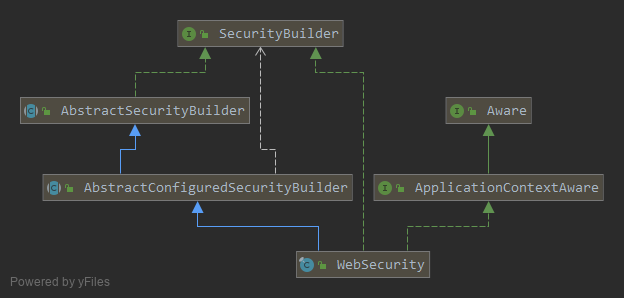
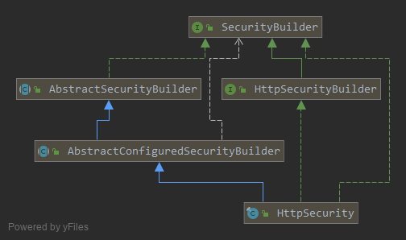

#### 授权服务器配置

使用@EnableAuthorizationServer，继承AuthorizationServerConfigurerAdapter 来配置OAuth2.0授权服务器

```java
@Configuration
@EnableAuthorizationServer
public class AuthorizationServerConfig extends AuthorizationServerConfigurerAdapter {
    // ...
}
```

AuthorizationServerConfigurerAdapter要求配置以下几个类，它们由Spring创建的独立的配置对象，会被Spring传入AuthorizationServerConfigurer中进行配置

```java
public class AuthorizationServerConfigurerAdapter implements AuthorizationServerConfigurer {
    public AuthorizationServerConfigurerAdapter() {}
    public void configure(AuthorizationServerSecurityConfigurer security) throws Exception {}
    public void configure(ClientDetailsServiceConfigurer clients) throws Exception {}
    public void configure(AuthorizationServerEndpointsConfigurer endpoints) throws Exception {}
}

```


## SpringSecurity源码解读

(一) `spring security`启动`WebSecurityConfiguration`主要做了两件事情：

1. 根据`WebSecurityConfigurerAdapter`中配置的信息创建`WebSecurity`这个类。
2. `springSecurityFilterChain()`创建了一个名叫`springSecurityFilterChain`的过滤器，然后值得一提的是在调用`WebSecurity`的`build()`创建过滤器的时候，调用到了`WebSecurity`的`init()`方法创建了一个`HttpSecurity`的对象，这里会根据配置为我们创建过滤器，最后添加到`DefaultSecurityFilterChain`过滤器链里面来。





```java
public interface SecurityBuilder<O> {
	O build() throws Exception;
}

```


```java
public interface HttpSecurityBuilder<H extends HttpSecurityBuilder<H>> extends
		SecurityBuilder<DefaultSecurityFilterChain> {
	<C extends SecurityConfigurer<DefaultSecurityFilterChain, H>> C getConfigurer(
			Class<C> clazz);

	<C extends SecurityConfigurer<DefaultSecurityFilterChain, H>> C removeConfigurer(
			Class<C> clazz);

	<C> void setSharedObject(Class<C> sharedType, C object);

	<C> C getSharedObject(Class<C> sharedType);

    /**
     * 具体的用户验证的方式，比如用户名密码形式,邮箱密码形式，短信验证码形式的登录等等
     */	
	H authenticationProvider(AuthenticationProvider authenticationProvider);

    /**
     * 主要有一个方法根据username去获取用户信息
     */
	H userDetailsService(UserDetailsService userDetailsService) throws Exception;

	H addFilterAfter(Filter filter, Class<? extends Filter> afterFilter);

	H addFilterBefore(Filter filter, Class<? extends Filter> beforeFilter);

	H addFilter(Filter filter);
}

```




#### HttpSecurity

`HttpSecurity` 最终可以得到一个 `DefaultSecurityFilterChain` 通过的是 `build()` 方法

- `HttpSecurity` 维护了一个过滤器的列表，这个过滤器的列表最终放入了`DefaultSecurityFilterChain` 这个过滤器链中

- `HttpSecurity` 最终提供了很多的配置，然而所有的配置也都是为了处理维护我们的过滤器列表


`AuthenticationEntryPoint` 用来解决匿名用户访问无权限资源时的异常

`AccessDeineHandler` 用来解决认证过的用户访问无权限资源时的异常


