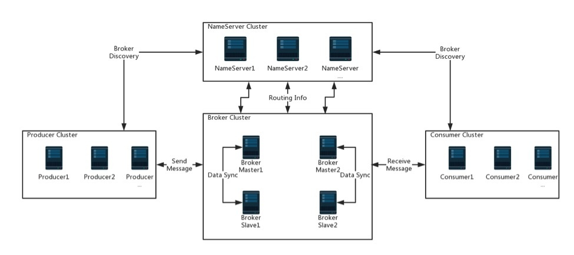

#### 1.安装

1 启动nameserver:

```bash
docker run -d -p 9876:9876 --name rmqserver  foxiswho/rocketmq:server-4.5.1
```

2 启动broker:

```bash
docker run -d -p 10911:10911 -p 10909:10909\
 --name rmqbroker --link rmqserver:namesrv\
 -e "NAMESRV_ADDR=namesrv:9876" -e "JAVA_OPTS=-Duser.home=/opt"\
 -e "JAVA_OPT_EXT=-server -Xms128m -Xmx128m"\
 foxiswho/rocketmq:broker-4.5.1
```

>#默认的配置文件的路径为
>
>-v  /conf/broker.conf:/etc/rocketmq/broker.conf 
>
>

3 启动console：

```bash
docker run -d --name rmqconsole -p 8180:8080 --link rmqserver:namesrv\
 -e "JAVA_OPTS=-Drocketmq.namesrv.addr=namesrv:9876\
 -Dcom.rocketmq.sendMessageWithVIPChannel=false"\
 -t styletang/rocketmq-console-ng
```


一键安装(centos)：

```bash
#!/bin/bash
echo "=========================环境清除与创建准备========================="
if [ ! -d "/opt/docker-rocketmq/" ]; then
        mkdir /opt/docker-rocketmq/
fi
docker rm rocketmq-namesrver rocketmq-broker rocketmq-console -f
rm -rf /opt/docker-rocketmq/*
mkdir -p /opt/docker-rocketmq/namesrver/logs
mkdir -p /opt/docker-rocketmq/namesrver/store
mkdir -p /opt/docker-rocketmq/broker/logs
mkdir -p /opt/docker-rocketmq/broker/store
management_ip=$(ifconfig $(route -n| awk 'NR==3{print}'|awk  '{print $8}') | grep "broadcast" | awk '{ print $2}')
cat << EOF >> /opt/docker-rocketmq/broker/broker.conf
brokerIP1=${management_ip}
EOF

echo "=========================server实例创建================="
docker run -d -p 9876:9876 --restart=always \
-v /opt/docker-rocketmq/namesrver/logs:/root/logs \
-v /opt/docker-rocketmq/namesrver/store:/root/store \
--name rocketmq-namesrver   foxiswho/rocketmq:server-4.5.2

echo "=========================broker实例创建================="
docker run -d -p 10911:10911 --restart=always \
-p 10909:10909 \
-v /opt/docker-rocketmq/broker/logs:/root/logs \
-v /opt/docker-rocketmq/broker/store:/root/store \
-v /opt/docker-rocketmq/broker/broker.conf:/etc/rocketmq/broker.conf \
--name rocketmq-broker --link rocketmq-namesrver:namesrv \
 -e "NAMESRV_ADDR=namesrv:9876" \
 -e "JAVA_OPTS=-Duser.home=/opt" \
 -e "JAVA_OPT_EXT=-server -Xms128m -Xmx128m" \
 foxiswho/rocketmq:broker-4.5.2

echo "=========================rocketmq-console安装==============="
docker run -d --name rocketmq-console --link rocketmq-namesrver:namesrv  -e "JAVA_OPTS=-Drocketmq.namesrv.addr=namesrv:9876 -Dcom.rocketmq.sendMessageWithVIPChannel=false" -p 8080:8080 --restart=always  styletang/rocketmq-console-ng

```


#### 2.简介

###### 2.1架构图



`NameServer`: 

- 消息队列的协调者，Broker向它注册路由信息，同时Client向其获取路由信息；
- NameServer本身是没有状态的，并且多个NameServer直接并没有通信，可以横向扩展多台，Broker会和每一台NameServer建立长连接

`Broker`:

- Broker是RocketMQ的核心，提供了消息的接收，存储，拉取等功能
- 支持 Push 和 Pull 模式，包含容错机制，提供了强大的峰值填充和以原始时间顺序累计数千亿条消息的能力；
- 一般都需要保证Broker的高可用，所以会配置Broker Slave，当Master挂掉之后，Consumer然后可以消费Slave；
- Broker分为Master和Slave，一个Master可以对应多个Slave，Master与Slave的对应关系通过指定相同的BrokerName，不同的BrokerId来定义，BrokerId为0表示Master，非0表示Slave，而传统的消息传递系统都缺乏这些机制。

`Producer`:

- 消息队列的生产者，需要与NameServer建立连接，从NameServer获取Topic路由信息;
- 向提供Topic服务的Broker Master建立连接.

`Consumer`:

- 消息队列的消费者，同样与NameServer建立连接，从NameServer获取Topic路由信息;
- 与提供Topic服务的Broker Master，Slave建立连接；


#### 3. 生产者

###### 3.1 通信模式（CommunicationMode）

- 同步发送(SYNC)：在发送完消息之后，会立马返回了发送结果；

- 异步发送(ASYNC)：发送消息时指定了SendCallback回调类（重写onSuccess和onException), send发送方法返回值为void；

- 单向发送(ONEWAY)：单向发送消息发送之后没有响应，方法返回void。 消费端可以收到消息。

###### 3.2 发送状态

同步和异步发送成功时，状态都是`SEND_OK`，除此还有其它状态，详见`SendStatus`

- `FLUSH_DISK_TIMEOUT`:  刷盘超时，Broker设置的刷盘策略为SYNC_FLUSH才可能出现此错误;

- `FLUSH_SLAVE_TIMEOUT`: 主从同步超时，Broker设置了slave，并且指定同步策略为SYNC_Master；

- `SLAVE_NOT_AVAILABLE`: 找不到salve，同样是Broke指定同步策略为SYNC_Master； 

###### 3.3 消息类型

- 延迟消息：RocketMQ支持发送延迟消息，Broker收到消息后会延迟一段时间在处理；

- 顺序消息：顺序消息指生产者生产数据的顺序和消费者消费数据的顺序是一致的。包括全局顺序消息和局部顺序消息；
  - 全局顺序消息指在某个Topic下所有消息都是顺序的（方案：设置Topic的读写队列都为1，保证生产者和消费者不能并发处理）
  
    ```java
    consumer.setConsumeThreadMin(1);
    consumer.setConsumeThreadMax(1);
    ```
  
  - 局部顺序消息指在Topic下的Message Queue中是顺序的（方案：生产者需要将相关业务的消息发送到同一个Message Queue，在消费端需要保证同一个Message Queue读取的消息不能被并发处理）
  
- 事务消息: 事务消息是指RocketMQ发送的消息和其他本地事件需要同时成功同时失败，可以理解为就是分布式事务,流程：

  >1.生产者发送"待确认"消息；
  >2.RocketMQ接收到消息进行相关保存操作，成功以后返回状态给生产者；
  >3.生产者接收到的返回如果为SEND_OK状态，将执行本地事务操作；
  >4.根据本地事务执行的结果，生产者执行commit还是rollback；
  >5.如果第四步生产者执行操作失败，服务器会在经过固定时间段对状态为"待确认"的消息发起回查请求；
  >6.生产者接收到回查请求后根据本地事务的结果返回commit还是rollback；
  >7.服务器收到结果后执行相关操作。

#### 4.消费者


#### 5.FAQ

- 消息内容体是如何被序列化与反序列化的?

>RocketMQ的消息体都是以`byte[]`方式存储。当业务系统的消息内容体如果是`java.lang.String`类型时，统一按照`utf-8`编码转成`byte[]`；如果业务系统的消息内容为非`java.lang.String`类型，则采用[jackson-databind](https://github.com/FasterXML/jackson-databind)序列化成`JSON`格式的字符串之后，再统一按照`utf-8`编码转成`byte[]`。

- 如何指定tags?

>一个应用尽可能用一个Topic，消息子类型用`tags`来标识，`tags`可以由应用自由设置。 在使用`rocketMQTemplate`发送消息时，通过设置发送方法的`destination`参数来设置消息的目的地，`destination`的格式为`topicName:tagName`，`:`前面表示topic的名称，后面表示`tags`名称。目的地只能指定一个topic下的一个`tag`，不能指定多个。

#### 6. 参考

[RocketMQ生产者流程篇](https://segmentfault.com/a/1190000018160931)
[RocketMQ生产者消息篇](https://segmentfault.com/a/1190000018234735#item-3-3)


